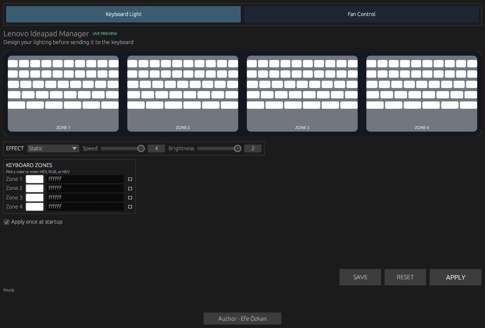
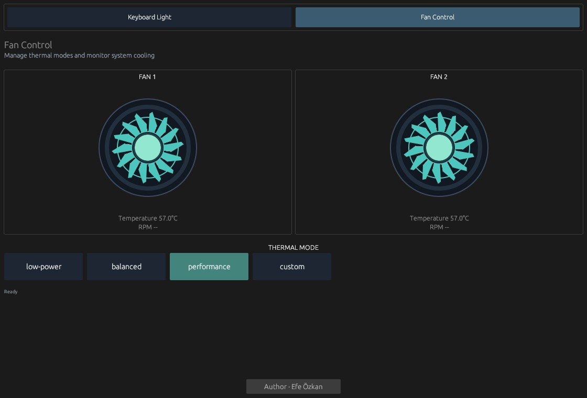

# Lenovo Ideapad Manager

A Linux-only Lenovo Ideapad management application written in Rust.

## Features

- Keyboard lighting effects with four zones and live preview
- HEX, RGB, and HSV color input
- Brightness, speed, and wave direction controls
- Fan Control page with two animated fan visualizations
- Four thermal profiles with immediate selection and persistence
- Temperature and fan RPM monitoring when exposed by the system
- Persistent privileged helper for keyboard and thermal changes
- Optional startup application
- No application-level `unsafe` code

## Screenshots

### Keyboard Lighting



### Fan Control



## Requirements

- Linux
- Rust and Cargo
- libusb
- pkexec with a desktop PolicyKit authentication agent
- Supported Lenovo keyboard device: `048d:c963`
- ACPI platform profiles for thermal mode control

## Install

```sh
cargo install --path . --locked
~/.cargo/bin/lenovo-ideapad-manager
```

If `~/.cargo/bin` is in your `PATH`, run:

```sh
lenovo-ideapad-manager
```

## Run

```sh
cargo run --release
```

Use the `Apply` button to save and apply keyboard settings. Fan profiles are applied and saved immediately when selected.

The optional startup entry is created at:

```text
~/.config/autostart/lenovo-ideapad-manager.desktop
```

If USB access is denied, add a udev rule for the supported device:

```text
/etc/udev/rules.d/10-kblight.rules
SUBSYSTEM=="usb", ATTR{idVendor}=="048d", ATTR{idProduct}=="c963", MODE="0666"
```

```sh
sudo udevadm control --reload-rules
sudo udevadm trigger
```

## License

This project is available under the MIT License.

## Project

[efeozkan.com.tr](https://efeozkan.com.tr)
